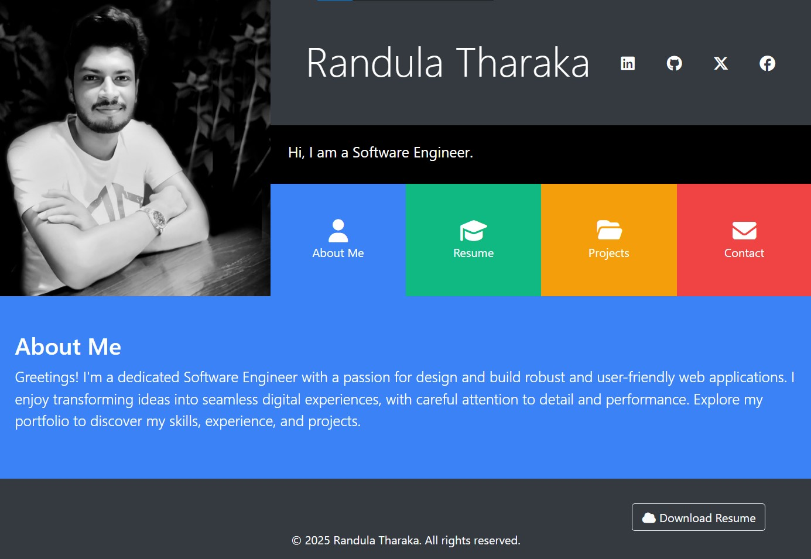

# 💻 Portfolio Website

> Built with HTML, CSS, Bootstrap, JavaScript

🌐 [Visit Site](https://randulatharaka.github.io/Portfolio/)

A modern, responsive personal portfolio website to showcase my skills, experience, and projects as a Software Engineer and Full Stack Developer.

## 📄 License

All rights reserved. This project is provided for demonstration purposes only. [License](LICENSE)

## 🤝 Connect With Me

I'm passionate about building full-stack applications and open to new opportunities in software development.

Feel free to connect or reach out!

